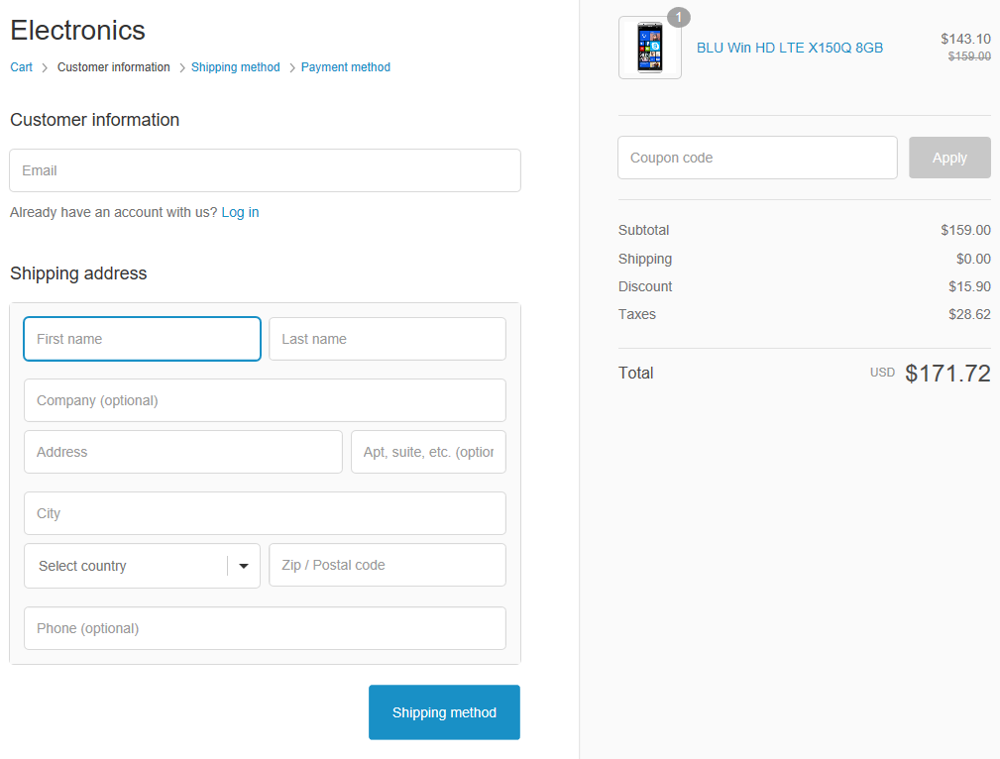

<section itemscope itemtype="http://schema.org/Article">
    <meta itemprop="author" content="Virtocommerce">
    <meta itemprop="datePublished" content="2017-09-06">
    <meta itemprop="dateModified" content="2018-02-22">
    

        
        

            

                <h1 itemprop="headline" class="title">Best ASP.NET Shopping cart Software</h1>
            

            

                <ul class="socials list" style="margin-top: 20px;">
                    <li class="list-item fb">
                        <a class="list-link" href="https://www.facebook.com/sharer/sharer.php?u={{ '/shopping-cart' | absolute_url }}" target="_blank"><i class="list-ico fa fa-facebook"></i></a>
                    </li>
                    <li class="list-item plus">
                        <a class="list-link" href="https://plus.google.com/share?url={{ '/shopping-cart' | absolute_url }}" target="_blank"><i class="list-ico fa fa-google-plus"></i></a>
                    </li>
                    <li class="list-item tw">
                        <a class="list-link" href="https://twitter.com/intent/tweet?text={{ '/shopping-cart' | absolute_url }}" target="_blank"><i class="list-ico fa fa-twitter"></i></a>
                    </li>
                    <li class="list-item in">
                        <a class="list-link" href="https://www.linkedin.com/shareArticle?mini=true&url={{ '/shopping-cart' | absolute_url }}" target="_blank"><i class="list-ico fa fa-linkedin"></i></a>
                    </li>
                </ul>
            

            <h2 class="sub-title">Open source shopping cart software</h2>
            
Here’s some great news for smaller companies - Virto Commerce is now available for startups! Pretty much every company faces a point in its growth when using free shopping cart software is simply not enough for its business needs anymore. However, many startups experience all sorts of complications when a migration from free/<a href="{{ '/glossary/hosted-shopping-cart' | absolute_url }}">hosted shopping cart</a> software to a more sophisticated ecommerce platform is required. Let alone the upfront investments that are usually required - so it can be a scary move.

            
This is where Free Virto Commerce Community Edition deployed on Microsoft Azure Cloud becomes a natural choice for any startup. It lets you adopt the fully ready ASP shopping cart along with the solution that’s going to grow along with your business. And it’s risk-free for your company’s budget - we only benefit, if you do!

            <h2 class="sub-title">Shopping user experience</h2>
            

                

                    Virto Commerce offers a fully set up ASP.net shopping cart that provides you with the right technology, so you can focus on designing outstanding user experience (UX).
                    
Open architecture allows you to easily adapt to new trends in the dynamic e-commerce market without losing competitive advantages.

                    
In addition to the convenient and sophisticated ASP.net shopping cart you can take advantage of such additional features as A/B testing, commerce analytics and many more. They all come with the Virto Commerce solution.

                

                

                    
                        
                        <meta itemprop="width" content="355">
                        <meta itemprop="height" content="336">
                    
                

            

            <h2 class="sub-title">Checkout/integration</h2>
            

                

                    
                

                

                    Checkout is one of the most important spots for integration and extensibility for advanced e-commerce solutions. The Checkout is often the weak point in shopping carts, especially the cloud based ones.
                    
Virto Commerce addresses this issue effectively. Our open modular architecture allows businesses to model their processes easily using extensions and workflows from Virto Commerce as well as 3rd party developers.

                

            

            <h2 class="sub-title">B2B Shopping Cart</h2>
            

                

                    In addition to standard functionality that is integral to any Shopping Cart, our shopping cart on ASP.net comes with additional features like wishlist, connecting payment gateway and checkout customization. This provides you with additional opportunities to customize your sales-related processes and make sure your store delivers the best experience to your customers.
                    
The Virto Commerce platform includes extended capabilities that allow for the implementation of complex B2B Enterprise scenarios as well as non-typical Startup models.

                

                

                    
                

            

            

                <iframe width="400" height="315" src="https://www.youtube.com/embed/QpRG-HOlrbc?ecver=1" frameborder="0" allowfullscreen></iframe>
                <iframe width="400" height="315" src="https://www.youtube.com/embed/22BMH86RQys?ecver=1" frameborder="0" allowfullscreen></iframe>
            

            

                <h2 class="sub-title">Our customers about Virto Commerce ASP.Net shopping cart</h2>
            

            

                <ul class="list">
                    <li class="list-item">
                        
Christoffer Iveslätt

                        
Marketing Manager at Belysningsdesign

                        
"Our vision is to offer the best lighting on the market at an affordable price and to make sure that our customers will have a good user experience."

                    </li>
                    <li class="list-item">
                        
Muhammed Usman

                        
Technical Project Manager on the VC ASP.Net Shopping Cart Project

                        
"The Virto platform allowed to get started quickly towards our customized solution. The documentation and feedback from the VC team helped us get familiar with functionality, which made it easier to extend the codebase for our client's needs."

                    </li>
                    <li class="list-item">
                        
Sergey Sinyugin

                        
CEO Kupinatao

                        
"Using Virto Commerce Shopping Cart on ASP.Net with its sophisticated features helped us to create a sophisticated system of gathering, publishing and managing client reviews. This automation tool helps our clients to choose between millions of positions."

                    </li>
                </ul>
            

            
            
            

                <a class="button fill" href="/try-now">Try It Now</a>
                <a class="button fill" href="/contact-us">Request Information & Personal Demo</a>
            

        

    

</section>