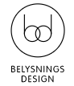
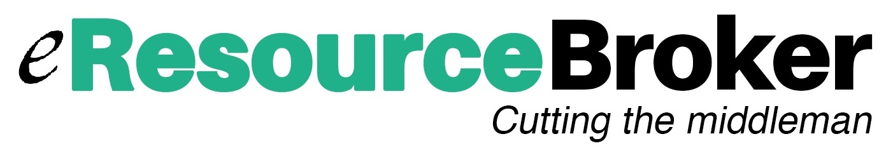

    

        <h1 class="head-title">Case studies</h1>
        <ul class="list __studies">
            <li class="list-item">
                

                    

                        
                    

                    
Retail Equipment

                    
Objective: B2C/B2B Online Store

                    
Providing maximum scalability and centralizationfor expanding business internationally

                    

                        <a class="button fill" href="case-studies/proffsmagasinet">View case study</a>
                    

                

            </li>
            <li class="list-item">
                

                    

                        
                    

                    
B2B Gifts

                    
Objective: Platform

                    
Consolidate various system using single platform to manage gift certificates for largest companies in the world. Provides both B2C and B2B solutions.

                    

                        <a class="button fill" href="case-studies/gift">View case study</a>
                    

                

            </li>
            <li class="list-item">
                

                    

                        
                    

                    
Retail lighting

                    
Objective: B2C Online Store

                    
Create value through growth in profits by expanding the existing stores.

                    

                        <a class="button fill" href="case-studies/belysningsdesign">View case study</a>
                    

                

            </li>
            <li class="list-item">
                

                    

                        
                    

                    
RETAIL FLOWERS

                    
Objective: Premium market

                    
Used cloud capabilities to launch a premium same day delivery flower service Kalla.com in just over a month time.

                    

                        <a class="button fill">Coming soon ...</a>
                    

                

            </li>
            <li class="list-item">
                

                    

                        
                    

                    
RETAIL MARKETPLACE

                    
Objective: New Marketplace

                    
Used platform capabilities to develop marketplace that sells thousands of products to CIS countries. 

                    

                        <a class="button fill" href="case-studies/kitmall">View case study</a>
                    

                

            </li>
            <li class="list-item">
                

                    

                        
                    

                    
Retail Blinds

                    
Objective: B2C/B2B Online Store

                    
Flexible solution with maximum customization for the online window-treatment website.

                    

                        <a class="button fill" href="case-studies/blinds">View case study</a>
                    

                

            </li>
            <li class="list-item">
                

                    

                        
                    

                    
MARKETPLACE

                    
Objective: Platform

                    
Created platform that allows sellers from china sell to the eastern europe countries. Integrated warehouse, merchandising, customer support and marketing.

                    <a class="list-link">Play video</a>
                    

                        <a class="button fill" href="case-studies/kupinatao">View case study</a>
                    

                

            </li>
            <li class="list-item">
                

                    

                        
                    

                    
FINANCIAL SERVICES

                    
Objective: Employee store

                    
Provided warehouse management for a one of the Switzerland's leading providers of auditing, accounting and consulting services company as well as permission controlled store for employees to place orders.

                    

                        <a class="button fill">Coming soon ...</a>
                    

                

            </li>
            <li class="list-item">
                

                    

                        
                    

                    
HR

                    
Objective: Platform

                    
Create a simple system for clients to directly search for available and compatible resources, thereby facilitating the trading process between clients and consultants.

                    

                        <a class="button fill" href="case-studies/cifereca">View case study</a>
                    

                

            </li>
            <li class="list-item">
                

                    

                        
                    

                    
WAREHOUSING & DISTRIBUTION

                    
Objective: B2B Platform

                    
Swiss company created a B2B store for travel agencies to distribute brochures and other marketing materials in efficient and cost affective manner.

                    

                        <a class="button fill">Coming soon ...</a>
                    

                

            </li>
            <li class="list-item">
                

                    

                        
                    

                    
RETAIL PRINTING

                    
Objective: Order platform

                    
Alexander's took over MyCanvas service from Ancestry.com and used Virto Commerce to migrate from tightly integrated application to a completely new extensible platform.

                    

                        <a class="button fill">Coming soon ...</a>
                    

                

            </li>
        </ul>
    

