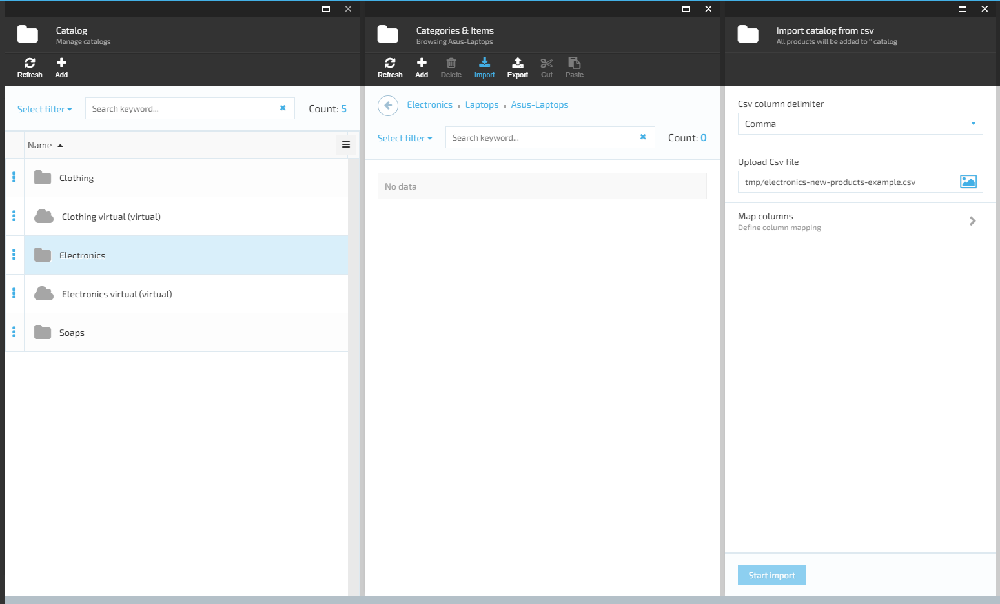
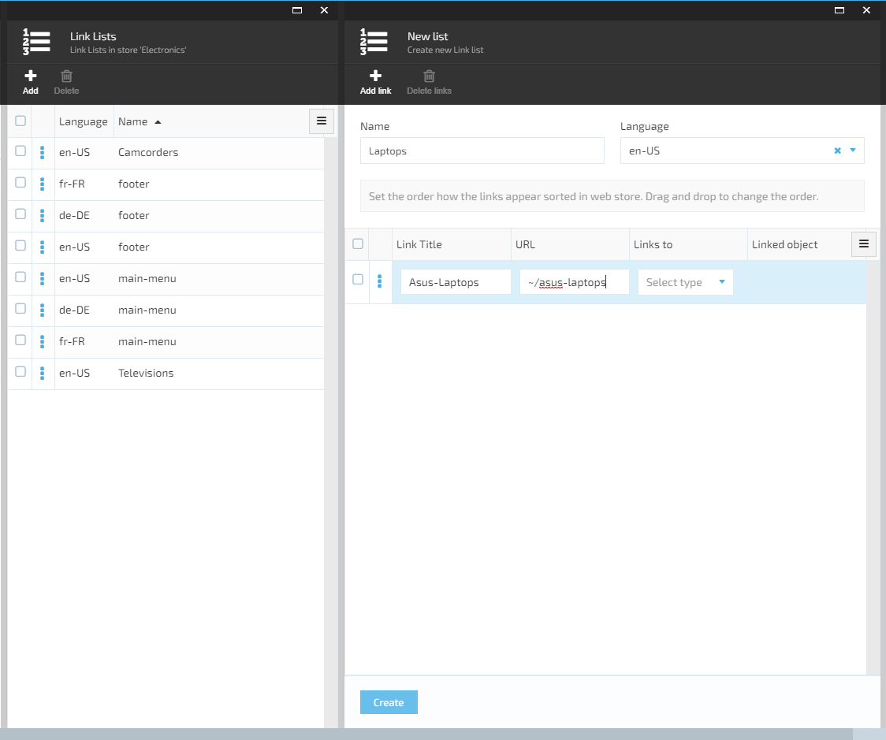
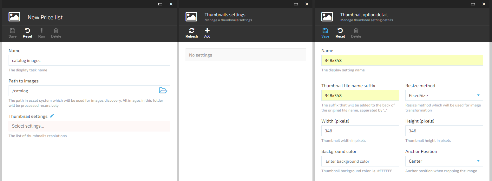
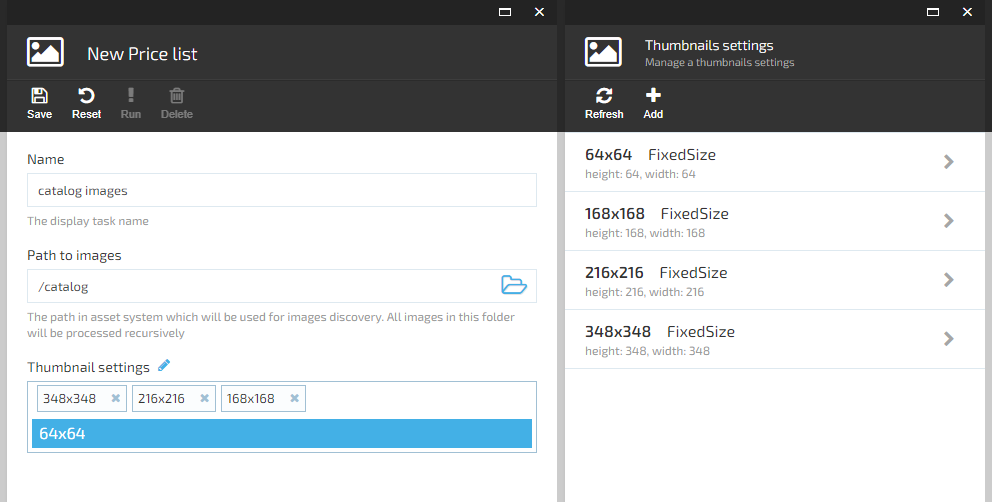

## Summary

Use this guide to import new products into Virto Commerce Platform(backend) catalog and test them locally in Virto Commerce Storefront(frontend).

## Prerequisites

* Download the <a href="https://github.com/VirtoCommerce/vc-content/tree/lesson2/pages/docs/lessons/electronics-new-products-example.csv" target="_blank">electronics-new-products-example.csv</a> file with new products.
* Download the <a href="https://github.com/VirtoCommerce/vc-content/tree/lesson2/pages/docs/lessons/images-example.zip" target="_blank">images-example.zip</a> file with 15 images of new products.
* Word Excel or <a href="https://www.libreoffice.org/" target="_blank">LibreOffice(*free*)</a>.

## Create catalog data file in .csv format

* To create file with products like downloaded **electronics-new-products-example.csv** you need to create new file in any of Word Excel or LibreOffice programm.
* In Excel just select the product properties you need from the list and fill in the product properties columns as in our document. Set to the PrimaryImage column pathes to your images in **Assets**.
* In LibreOffice you need to create table with the number of columns equal to the number of properties of your products and fill it. For a delimiter, select a comma.
* Save file in .csv format.

## How to create new Catalog or use an existing one

* Open locally Virto Commerce Platform(see how to deploy and open it in <a href="https://github.com/VirtoCommerce/vc-content/tree/lesson2/Pages/docs/lessons/lesson1.md" target="_blank">Lesson 1</a>)
* There are 2 scenarios for adding new products: adding to a new catalog or to an existing one.

### Create new category and subcategory

* To create new category in **Electronics Theme** click on **More > Catalog > Electronics** > click on **+Add** > choose the **Category** > add category name **Laptops** and code(optional), push on button **Create**.

* Click on the **Laptops** in categories list. To create new subcategory, click on **+ Add** > choose the **Category** > add category name **Asus-Laptops** and code(optional), push on button **Create**.
* By click on **More > Catalog > Electronics > Laptops > Asus-Laptops** you will see all created categories. If you want to get Asus-Laptops CategoryId for using it in .csv file - click on categories page menu, select **Id** by check box and copy Asus-Laptops Id value.

### Use an existing catalog and categories

* Click on **More > Catalog**. Select the catalog and category names in which you want to add new products.

## Upload images for new products

* You need to add images for products: go to **More > Assets > catalog >** click on the **New folder** icon, type **ASUS** name, click button **Ok**.

* Click on the **Upload** icon and select in File Explorer all downloaded example images from **images-example.zip**. Now you could see all images in the new **ASUS** catalog.

## Import and mapping your catalog data to Virto Commerce Platform(*backend*)

* At the top of the **Asus-Laptops** category page click on the **Import** icon > **VirtoCommerce CSV import** > select **Semicolon** in **Csv column delimiter** > click on image to upload **electronics-new-products-example.csv** file. Wait a minute... **Note** that importing new products from the file without specifying either the id category or the category path in it, defaults to the root directory - to the catalog.

* After uploading your data, click on **Map column**. On this page you will see and edit how the properties of your products will be maped to the default properties defined in application, just so they will be saved to the database after you clicking buttons **Ok** and **Start Import**. Wait a minute...

## Open new products in Virto Commerce Platform(*backend*)

* Now you can see and edit all new products after clicking on **More > Catalog > Electronics > Laptops > Asus-Laptops**

## Creating a new menu item in Virto Commerce Storefront(*frontend*)

* To add new category to menu in Virto Commerce Storefront(*frontend*) open Virto Commerce Platform(*backend*), click on **More > Content >** Link list in **Electronics > en-US main menu >** icon **+ Add link** and add Link Title - **Laptops**, URL - **~/laptops**, Links to - **Category**, Linked object - **Laptops**: click on button **Select > Electronics**, select **Laptops** via check box and click on icon **+ Pick selected**, save changes.

* To add new link for subcategory **Asus Laptops** to menu in Virto Commerce Storefront(*frontend*) open Virto Commerce Platform(*backend*), click on **More > Content >** Link list in **Electronics >** icon **+ Add** >** icon **+ Add link**. Add Name - **Asus-Laptops**, Language - **en-US**, Link Title - **Asus Laptops**, URL - **~/asus-laptops**, push on button **Create**.

## Creating thumbnails for new product images

* You need to create thumbnails for new images. For this need to **only once** creating new task for thumbnails generation: go to **More > Thumbnails >** click on **+ Add** icon, enter Name - **catalog images**, Path to images - **/catalog**, click on penсil icon near **Thumbnail setting** and on **+ Add** icon.

* Create and save thumbnail option details: Name - **348x348**, Thumbnail file name suffix - **348x348**, Resize method - **FixedSize**, Width - **348**, Height - **348**, Anchor Position - **Center**. Similarly for 3 other resolutions: **216x216, 168x168, 64x64**. 
* Put the cursor in the **Thumbnail settings** field, add all settings, save new thumbnails generation task.

* Select **catalog images** task in task list by check box, click on **! Run** icon, push button **Regenerate** in pop-up window. Wait a minute... All done. If you later add new pictures and generate thumbnails for them, select the button **Process changes**.

## Build search indexes and reset cache

* By default indexes building by system throughout 5 minutes. If you want to build search indexes for new categories and products immediately, open Virto Commerce Platform(*backend*), go to **More > Search index >** select all document types via check boxes **>** click on icon **Build index**, in pop-up window push on button **Build**.

* You need to reset cache - open Virto Commerce Platform(*backend*), go to **More > Stores > Electronics >** icon **Reset cache** on **Store details** page, push on button **Ok**.

## Open new products in Virto Commerce Storefront(*frontend*)

* Open locally Virto Commerce Storefront(see how to deploy and open it in <a href="https://github.com/VirtoCommerce/vc-content/tree/lesson2/Pages/docs/lessons/lesson1.md" target="_blank">Lesson 1</a>).
* Now you can see new menu item **Laptops**, new subitem **Asus Laptops** and all new products in Virto Commerce Storefront(*frontend*).

## Product default properties in Virto Commerce Platform(*backend*)

* To create a new catalog file, you need to know which defined product properties you can use:

| Property Name                                  | Data Type       | Example                                                                   |
|------------------------------------------------|-----------------|---------------------------------------------------------------------------|
| Name (required)                                | text            | Asus VivoBook W202NA-DH02 Rugged 11.6-inch Windows 10 Home Laptop         |
| Id                                             | text            |                                                                           |
| Sku                                            | text            |                                                                           |
| CategoryPath (required if CategoryId is empty) | text            | Laptops/Asus-Laptops                                                      |
| CategoryId (required if CategoryPath is empty) | text            |                                                                           |
| MainProductId                                  | text            |                                                                           |
| PrimaryImage (image url in app)                | text            | http://localhost/admin/assets/catalog/PAHCVX870/1420483149000_1109406.jpg |
| AltImage                                       | text            | asus-vivobook-w202na-dh02                                                 |
| SeoUrl                                         | text            | asus-vivobook-w202na-dh02                                                 |
| SeoTitle                                       | text            |                                                                           |
| SeoDescription                                 | text            |                                                                           |
| SeoLanguage                                    | text            | en-US                                                                     |
| SeoStore (Id of Store)                         | text            |                                                                           |
| Review                                         | number (0 or 1) | 1                                                                         |
| ReviewType                                     | text            | FullReview(or QuickReview)                                                |
| IsActive                                       | number (0 or 1) | 1                                                                         |
| IsBuyable                                      | number (0 or 1) | 1                                                                         |
| TrackInventory                                 | number (0 or 1) | 1                                                                         |
| PriceId                                        | text            |                                                                           |
| SalePrice                                      | number          | 199.5                                                                     |
| ListPrice (required)                           | number          | 199.5                                                                     |
| Currency                                       | text            | USD                                                                       |
| PriceListId                                    | text            |                                                                           |
| Quantity (required, 0 and more)                | number          | 25                                                                        |
| ManufacturerPartNumber                         | text            | ASDJHG34GH-23                                                             |
| Gtin                                           | text            |                                                                           |
| MeasureUnit                                    | text            | mm                                                                        |
| WeightUnit                                     | text            | gram                                                                      |
| Weight                                         | number          | 125                                                                       |
| Height                                         | number          | 125                                                                       |
| Length                                         | number          | 125                                                                       |
| Width                                          | number          | 125                                                                       |
| TaxType                                        | text            |                                                                           |
| ProductType                                    | text            | Physical(or Digital)                                                      |
| ShippingType                                   | text            |                                                                           |
| Vendor                                         | text            | Asus                                                                      |
| DownloadType                                   | text            | Standard Product(or Software, or Music)                                   |
| DownloadExpiration                             | date            | 2018-04-05 21:47                                                          |
| HasUserAgreement                               | number (0 or 1) | 1                                                                         |

* To create your custom property of product you need to define it: in Virto Commerce Platform(*backend*) go to needed category > click on it's name by right mouse button and select **Manage** > **Properties** > **+ Add property**. Add new property name, 2 Display names - in english and deutsch, enable Multi language switch, if the property can have multiple value - enable mulivalue switch, select in Applies to **Product** and choose Value Type. If you need, set up Validation rules and Attributes. Click on **Save** at Manage property and **Ok buttons at Properties list of your category.

* Now you can add this property to .csv file for all products of this category.
