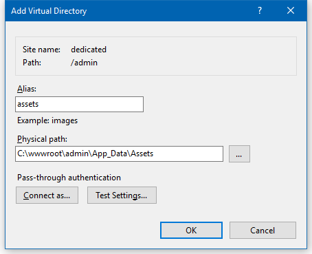

---
title: Deploy web applications to dedicated server
description: The article describes a process of deployin Virto Commerce web application to dedicated server
layout: docs
date: 2017-02-28T15:21:19.120Z
priority: 2
---
## Actions on local machine

### Prerequisites

* Microsoft .NET Framework 4.5.1
* <a href="https://nodejs.org/" rel="nofollow">Node.js</a>

## Downloading the precomplied version .zip File:

Navigate to the  <a href="https://github.com/VirtoCommerce/vc-platform/releases" rel="nofollow">Releases Section of Virto Commerce in GitHub.</a>

You will find VirtoCommerce.Platform.2.x.x.zip file. In this file the site has already been built and can be run without additional compilation. It does not includes all the source code.

Unpack follow zip to local disk to path '**c:\tmp**'. In result you should get '**c:\tmp\VirtoCommerce.Platform.Web**' folder which contains platform precompiled code.

### Upload files to the web server

Upload all data from  **c:\tmp\VirtoCommerce.Platform.Web** folder to the web server in IIS application root directory **'~/'**.

## Actions on web server

### Prerequisites

* Windows Server 2008 or later (IIS 7 or later)
* Microsoft .NET Framework 4.5.1
* <a href="https://www.microsoft.com/en-us/download/details.aspx?id=40784" rel="nofollow">Visual C++ Redistributable Packages for Visual Studio</a> (for storefront)
* Microsoft SQL Server 2008 or later

## Setup Virto Commerce Manager application

### Configure connection strings

* Open the **Web.config** file in a text editor.
* In the **connectionStrings** section change the following connection strings:
  * **VirtoCommerce**: parameters for  SQL server database. Provided user should have permission to create new database.
  * **SearchConnectionString**: type of search engine and its parameters.
  * **AssetsConnectionString**: type of asset storage and its parameters.

### Configure permissions for App_Data folder

Open properties for **~/App_Data** folder and give permission **Modify** to **IIS_IUSRS** user group.

### Configure IIS

* Open the **IIS Manager** and create a new website or new application named **admin** inside an existing website.
* In the **Physical path** field enter the full path to the platform site data folder **~/**.
* Select application pool which uses **.NET CLR Version 4.0** and **Integrated** pipeline mode:

* Inside the admin application add the new virtual directory with alias **assets** and physical path **~/App_Data/Assets**. If there is no Assets directory inside App_Data, create it:

* Open the Virto Commerce Manager application in the browser.
* On the first request the application will create and initialize database. After that you should see the sign in page. Use the following credentials:
  * Login: **admin**
  * Password: **store**

### Change administrator password

* In the left menu select **Configuration > Security**.
* Select **Users**
* Select the **admin** user.
* Click **Change password**.
* Enter the new password twice and click **OK**.

### Change API credentials for storefront application

* In the left menu select **Configuration > Security**.
* Select **Users**
* Select the **frontend** user.
* Click the **API Keys** widget.
* Select the **Frontend Hmac** key
* Click **Generate**, then **OK**, then **Save**.

## Setup Storefront application
Downloading the precomplied storefront files:

Navigate to the <a href="https://github.com/VirtoCommerce/vc-storefront/releases">Releases Section of Virto Commerce storefront in GitHub.</a>

You will find VirtoCommerce.Storefront.2.x.x.zip file. In this file the site has already been built and can be run without additional compilation. It does not includes all the source code.
Unpack this zip to a local directory 'C:\vc-storefront'. After that you will have the 'C:\vc-storefront\VirtoCommerce.Storefront' directory with storefront precompiled files.

### Configure web API base URL

* Open the **Web.config** in a text editor.
* In the **connectionStrings** section find the **add** node named **VirtoCommerce BaseUrl**. Change its **connectionString** attribute value to the URL of your **Commerce Manager** application.

### Configure web API credentials

* Open the **Web.config** in a text editor.
* In the **appSettings** section find the **add** nodes named **vc-public-ApiAppId** and **vc-public-ApiSecretKey** and change its values to values generated in **Virto Commerce Manager** application.

### Configure permissions for App_Data folder

Open properties for **~/App_Data** folder and give permission **Modify** to **IIS_IUSRS** user group:

### Configure IIS

* Open the **IIS Manager** and create a new website or new application inside an existing website.
* In the **Physical path** field enter the full path to the **~/** folder:

* Select application pool which uses **.NET CLR Version 4.0** and **Integrated** pipeline mode:

* Open the storefront application in the browser.
