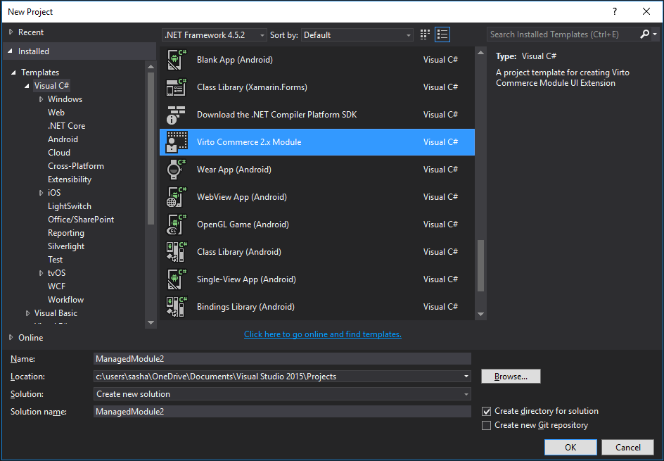
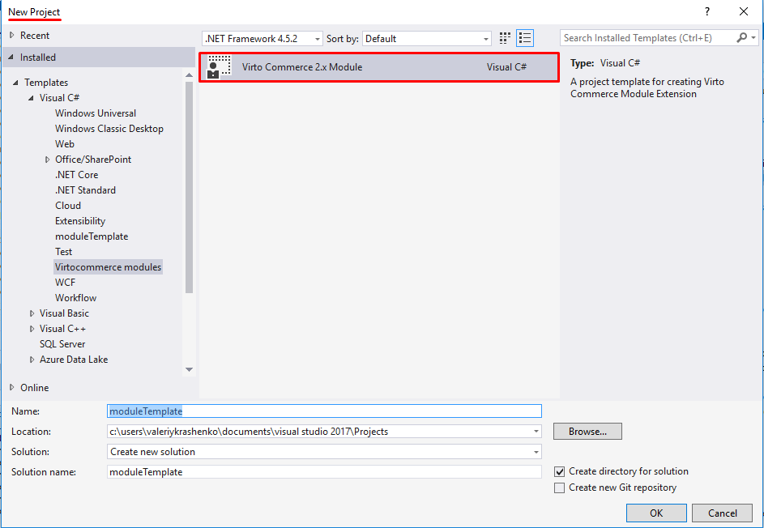

---
title: Creating new module
description: The article describes a process of creating a new module for Virto Commerce
layout: docs
date: 2016-06-02T07:27:54.917Z
priority: 1
---
## Summary

This tutorial will show you the steps required when creating a new module and adding it to the Virto Commerce Manager web application. You can also download Virto Commerce template from 
[Visual Studio Marketplace](https://marketplace.visualstudio.com/items?itemName=VirtoCommerce2xModuleProjectTemplate.VirtoCommerce2xModule), or simply search for "Virto" under online templates.



Download / fork source code for described modules from GitHub [vc-samples repository](https://github.com/VirtoCommerce/vc-samples).

## Overview

Virto Commerce Platform is an ASP.NET MVC and [AngularJS](http://angularjs.org/) Single Page Application with VirtoCommerce modularity extension.

A module in VirtoCommerce is a folder which contains at least **module.manifest** file. It can also contain any other content such as JavaScript files, CSS files, images, .NET assemblies, etc. Some content has a special meaning and should be mentioned in the module manifest. If a module contains .NET assemblies it is called a **managed module**.

Modules can extend the Virto Commerce Platform with JavaScript and/or managed code.

JavaScript allows you to:
* add new items to main menu
* add new widgets to widget containers (on dashboard or in blades)
* add new blades
* add new buttons to existing blade toolbars

Managed code allows you to:
* add new Web API controllers
* add new services
* override existing services
* modify database

As you can see with JavaScript you can extend the UI and with managed code you can extend the backend.

Also new security permissions and new application settings can be added to the module manifest, but they are still used either in JavaScript or in managed code.

In this tutorial you will learn how to create custom modules with and without managed code. Each module will be loaded to the main application and will have its entry in the main menu.

## Pure JavaScript module

In this part of the tutorial we'll create a JavaScript module called **Sample Unmanaged Module** which will add a new item to the main menu and open a new blade when this item is clicked.

The required part of each module is the manifest:

```
<?xml version="1.0" encoding="utf-8" ?>
<module>
  <id>Sample.Unmanaged</id>
  <version>2.0.0</version>
  <platformVersion>2.10</platformVersion>
  <title>Sample Unmanaged Module</title>
  <description>Lorem ipsum dolor sit amet, consectetur adipiscing elit. Aenean vitae sagittis nulla, ac condimentum quam. Maecenas sit amet nibh volutpat, eleifend enim sit amet, cursus erat.</description>
  <authors>
    <author>VirtoCommerce</author>
  </authors>
  <styles>
    <file virtualPath="$/Content/css/UnmanagedModule.css" />
  </styles>
  <scripts>
    <directory virtualPath="$/Scripts" searchPattern="*.js" searchSubdirectories="true" />
  </scripts>
</module>
```

**id**, **version** and **platformVersion** are required elements. This sample module has a single CSS style file and its JavaScript code is placed in the folder called $/Scripts. The $ sign in styles and scripts virtual paths is resolved to the module root folder at runtime by the platform's modularity extension. Title and description are displayed in the installed modules list. That's all what's needed to define a module.

One of the js files, UnmanagedModule.js, contains AngularJS module definition:

```
//Call this to register our module to main application
var moduleTemplateName = "platformWebApp.unmanagedModule";
if (AppDependencies != undefined) {
  AppDependencies.push(moduleTemplateName);
}
angular.module(moduleTemplateName, [
  'unmanagedModule.blades.blade1'
])
...
```

It registers itself as a dependency for the main AngularJS module. Then the module definition follows. As you can see, it also depends on the other module, *unmanagedModule.blades.blade1*.

The navigation between modules is based on $stateProvider and states. We register "workspace.unmanagedModuleTemplate" state in the same js file:

```
.config(
  ['$stateProvider',
    function ($stateProvider) {
      $stateProvider.state('workspace.unmanagedModuleTemplate', {
        url: '/unmanagedModule',
        templateUrl: 'Scripts/common/templates/home.tpl.html',
        controller: [
          '$scope', 'platformWebApp.bladeNavigationService', function ($scope, bladeNavigationService) {
             var blade = {
               id: 'blade1',
               // controller name must be unique in Application. Use prefix like 'um-'.
               controller: 'um-blade1Controller',
               template: 'Modules/$(Sample.Unmanaged)/Scripts/blades/blade1.tpl.html',
               isClosingDisabled: true
             };
             bladeNavigationService.showBlade(blade);
           }
         ]
      });
    }
  ]
)
```

This state has such typical parts as **url**, **templateUrl** and **controller**. What's not typical is that state name must begin with "workspace.*". The controller here is used only for displaying a new blade. All **controller names** of **all installed modules** in the **Platform** have to be **unique**.

The controller **um-blade1Controller** (located in **blade1.js**) and template **blade1.tpl.html** are super simple:

```
angular.module('unmanagedModule.blades.blade1', [])
.controller('um-blade1Controller', ['$scope', function ($scope) {
  var blade = $scope.blade;
  $scope.data = "UnmanagedModule content";
  blade.title = "UnmanagedModule title";
  blade.isLoading = false;
}]);
```
```
<div style="width: 400px;">
  <p>{{data}}</p>
</div>
```

### Referencing content files

The links to files inside the module folder should start with **Modules/$(ModuleId)/** where ModuleId is the ID of the module as declared in module.manifest file.

For instance, **Modules/$(Sample.Unmanaged)/Scripts/home/home.tpl.html**

### Adding new items to application's menu

The registration to the main application's menu:

```
.run(
  ['$rootScope', 'platformWebApp.mainMenuService', '$state', function ($rootScope, mainMenuService, $state) {
    //Register module in main menu
    var menuItem = {
      path: 'browse/unmanaged module',
      icon: 'fa fa-cube',
      title: 'Unmanaged Module',
      priority: 110,
      state: function () { $state.go('workspace.unmanagedModuleTemplate'); },
      permission: 'UnmanagedModulePermission'
    };
    mainMenuService.addMenuItem(menuItem);
  }]);
```

Mind the **priority** property as it defines the menu position relative to the other menu options; **smaller number means higher priority** and such menu item is displayed first.

That's it. Run VirtoCommerce Manager application to check how your new module looks like. It should have its own menu entry in the main menu:


## Module containing server side libraries

When pure JavaScript functionality is not enough, a module containing server side libraries should be created. Only the basic required steps for creating a module were described in the section above. They can be used when creating any kind of module (such as this one).

In this tutorial part we'll create a module called **Sample Managed Module**. It will open a blade and fill it with data returned from WebApi data service.

A managed module is a module which has a managed assembly with a class **implementing IModule** interface. This class should be declared in the module manifest.

When the application starts, it iterates two times through all managed modules:

Methods **SetupDatabase** and **Initialize** are called for each module.

* In SetupDatabase method a module can create or update tables and fill them with data.
* In Initialize method a module can register its services, repositories and other resources in Unity container.

Method **PostInitialize** is called for each module. In this method a module can resolve registered resources using Unity container and use them.The two-step initialization allows modules which are initialized later to override implementation of interfaces registered with modules which are initialized earlier.

### Create new module 

Create project by using our template as follows:



###  Module project structure and content

Class named Module and inherit it from ModuleBase class:

```
using VirtoCommerce.Platform.Core.Modularity;

namespace VirtoCommerce.ManagedModule.Web
{
  public class Module : ModuleBase
  {
    public override void SetupDatabase()
    {
    }

    public override void Initialize()
    {
    }

    public override void PostInitialize()
    {
    }
  }
}
```

Inheriting from the ModuleBase class ensures that this **VirtoCommerce.ManagedModule.Web.dll** will be loaded and available in Virto Commerce Manager application.

When Virto Commerce Manager application starts it calls **SetupDatabase** and **Initialize** methods for each module. When all modules are initialized, it calls **PostInitialize** method for each module. You can override these methods if you want to add your custom logic.

XML file named **module.manifest** is similar to the previous sample, but it also contains **assemblyFile** and **moduleType** elements which define the class implementing the IModule interface:

```
<?xml version="1.0" encoding="utf-8" ?>
<module>
    <id>Sample.Managed</id>
    <version>1.0.0</version>
    <platformVersion>2.13.9</platformVersion>

    <title>Sample Managed Module</title>
    <description>Enter your module description here.</description>
    <authors>
        <author>VirtoCommerce</author>
    </authors>

    <assemblyFile>VirtoCommerce.ManagedModule.dll</assemblyFile>
    <moduleType>VirtoCommerce.ManagedModule.Web.Module, VirtoCommerce.ManagedModule.Web</moduleType>

    <styles>
        <directory virtualPath="$/Content/css" searchPattern="*.css" searchSubdirectories="true" />
    </styles>
    <scripts>
        <directory virtualPath="$/Scripts" searchPattern="*.js" searchSubdirectories="true" />
    </scripts>

    <settings>
        <group name="General">
            <setting>
                <name> VirtoCommerce.ManagedModule.General.String</name>
                <valueType>string</valueType>
                <defaultValue>qwerty</defaultValue>
                <title>String</title>
                <description>A text setting</description>
            </setting>
            <setting>
                <name>VirtoCommerce.ManagedModule.General.Password</name>
                <valueType>secureString</valueType>
                <defaultValue>qwerty</defaultValue>
                <title>Password</title>
                <description>A secure text setting</description>
            </setting>
            <setting>
                <name>VirtoCommerce.ManagedModule.General.Integer</name>
                <valueType>integer</valueType>
                <defaultValue>123</defaultValue>
                <title>Integer</title>
                <description>An integer setting</description>
            </setting>
            <setting>
                <name>VirtoCommerce.ManagedModule.General.Decimal</name>
                <valueType>decimal</valueType>
                <defaultValue>123.45</defaultValue>
                <title>Decimal</title>
                <description>A decimal setting</description>
            </setting>
        </group>
        <group name="Advanced">
            <setting>
                <name>VirtoCommerce.ManagedModule.Advanced.Boolean1</name>
                <valueType>boolean</valueType>
                <defaultValue>true</defaultValue>
                <title>Boolean1</title>
                <description>A boolean setting</description>
            </setting>
            <setting>
                <name>VirtoCommerce.ManagedModule.Advanced.Boolean2</name>
                <valueType>boolean</valueType>
                <defaultValue>false</defaultValue>
                <title>Boolean2</title>
                <description>A boolean setting</description>
            </setting>
            <setting>
                <name>VirtoCommerce.ManagedModule.Advanced.Select</name>
                <valueType>string</valueType>
                <allowedValues>
                    <value>value1</value>
                    <value>value2</value>
                    <value>value3</value>
                </allowedValues>
                <defaultValue>defaultValue</defaultValue>
                <title>Select</title>
                <description>Select one of the allowed values</description>
            </setting>
        </group>
    </settings>
</module>
```

Project structure:

  

**ManagedModuleController.cs** containing data service for communicating with JavaScript client:

```
using System.Web.Http;
namespace VirtoCommerce.ManagedModule.Web.Controllers.Api
{
  [RoutePrefix("api/managedModule")]
  public class ManagedModuleController : ApiController
  {
    // GET: api/managedModule
    [HttpGet]
    [Route("")]
    public IHttpActionResult Get()
    {
      return Ok(new { result = "Hello world!" });
    }
  }
}
```

File **managedModuleApi.js** containing definitions for the resources (services) available inside AngularJS module:

```
angular.module('platformWebApp.managedModule')
.factory('managedModuleApi', ['$resource', function ($resource) {
  return $resource('api/managedModule');
}]);
```

The controller **blade1Controller** (located in **helloWorld_blade1.js**) and template **helloWorld_blade1.tpl.html**:

```
angular.module('platformWebApp.managedModule')
.controller('blade1Controller', ['$scope', 'managedModuleApi', function ($scope, managedModuleApi) {
  var blade = $scope.blade;
  blade.title = 'Managed API sample';
  blade.refresh = function () {
    managedModuleApi.get(function (data) {
      blade.data = data.result;
      blade.isLoading = false;
    });
  }
  blade.refresh();
}]);
```
```
<div style="width: 400px;">
  <p>{{blade.data}}</p>
</div>
```

The difference from previous controller is that it uses **managedModuleApi** to initialize scope values.

Compile your solution, restart IIS and open Manager in browser to check how your new module looks like.

If ManagedModule folder is not located under Manager's ~/Modules virtual directory, you should create a directory symbolic link to VirtoCommerce.ManagedModule.Web folder:

Run Command Prompt as an administrator;navigate to the physical location folder of Manager's ~/Modules virtual directory;
run command: 
```
mklink /d managedModule path_to_VirtoCommerce.ManagedModule.Web_folder
```