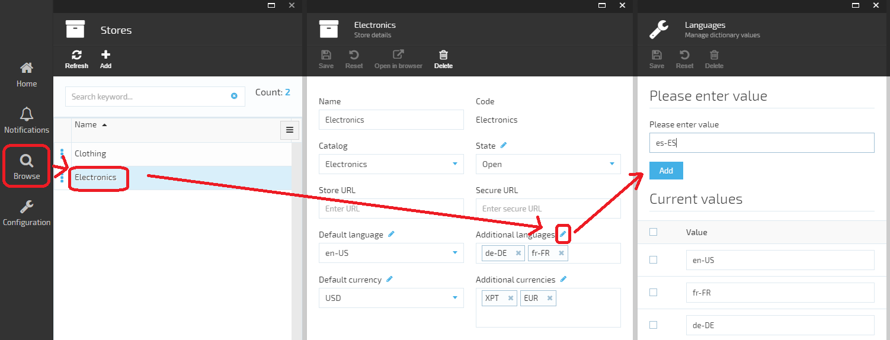

## Adding new language translation to Storefront

Storefront localization is very similar to [VC Manager localization](docs/vc2devguide/working-with-platform-manager/localization-implementation). Check it for details on working with translation files.

1. Make a copy of &lt;*vc-storefront repository location*&gt;\VirtoCommerce.Storefront\App_Data\Themes\default\locales\en.default.json file 
2. Rename the copied file to begin with your needed language 2 letter code (e.g., "es.default.json"). 
3. Translate the file content.

## Adding new language to Store
1. Open your store in VC Manager ( Browse > Stores > &lt;*your store*&gt; ).
2. Check whether your language exists in the "Additional languages" available values list or add it in case it's missing:

