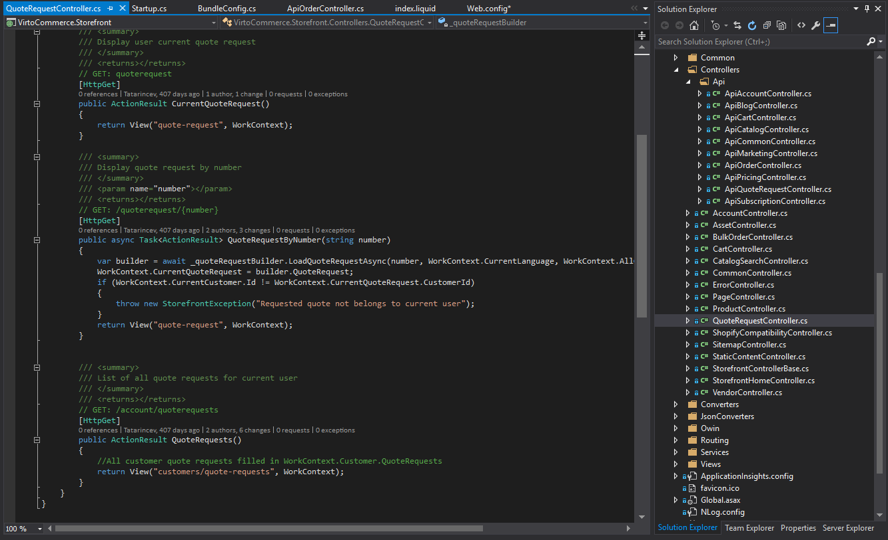

<article role="main" class="main">
    

        <h1 class="head-title">Consulting</h1>
        
Our professional services team is committed to helping you improve your business by keeping your Virto Commerce installation on-time, on-track, and perfectly tailored to your organization's unique requirements.

        

            <ul class="list">
                <li class="list-item">
                    
                    
Business Analyst Consulting

                    
Defining overall information architecture, data structures, and taxonomies can be complex and time-consuming. Our business analysts are seasoned experts who can help you identify gaps and risks in your project strategy while providing methodology and support during discovery workshops.
                    

                </li>
                <li class="list-item">
                    
                    
Technical Consulting

                    
We can provide expert advice, with or without development assistance, to build the solution you need according to Virto Commerce’s coding standards and best-practices. Our experts can review your code and provide you with recommendations to improve operational stability, security, and possible future upgrade issues.
                     
                    Through our on-site benchmarking and performance tuning service, we can also help your organization pinpoint and fix performance bottlenecks so you can maximize the responsiveness of various aspects within the system.
                    

                </li>
                <li class="list-item">
                    
                    
Audit

                    

We regularly perform functional and technical audits to ensure that our platform is being optimally utilized.
 
During functional audits, we analyze the product catalog structure to see if it complies with your company’s business standards and to see if the best structures and rules have been defined in Virto Commerce. 
During technical audits, we check the underlying code to ensure that it complies with our standards and best practices. Our experts can also check server installation to ensure that your catalog is optimized for performance, security, and easy maintenance. 
Once our audits are completed, we provide our customers with a detailed guide on how to improve their platform to better serve the end-users and increase productivity.                    
                    

                </li>
            </ul> 
        

    

    <!-- Prices -->
    

        Want to learn more about our services? <a class="button fill" href="/contact-us">Request more info</a>
    

    
</article>
