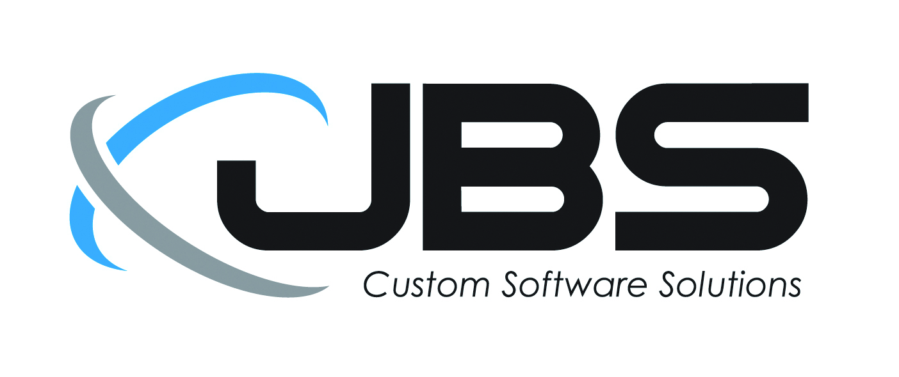
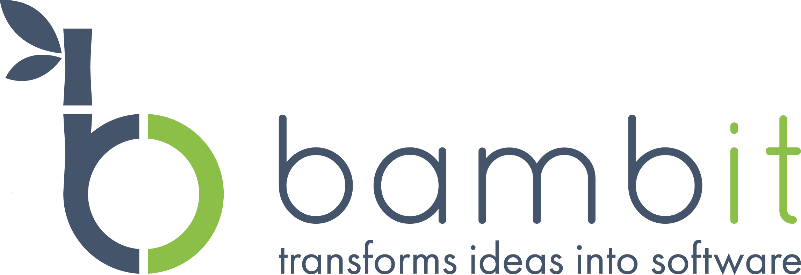

	<h1 class="head-title">Solution Partners</h1>
	
These are hand picked companies with expertise reviewed by us. They all have experiences delivering successful e-commerce solutions for medium and large businesses.

	<ul class="list">
		<li class="list-item">
			
			

				<a href="http://www.jbssolutions.com/" class="link" rel="nofollow">JBS</a>
				
United States

				
Languages Spoken: English

				
JBS is a custom application development and ecommerce solutions provider that has been in business since 1999. We are a long term Microsoft Gold Certified Partner with a highly experienced team of senior level Solutions Architects, Developers, Designers and Project Managers. We have a long track record of delivering custom solutions that work. Our clients range from companies on the Retail 100 list to mid-sized organizations to early round startups. JBS is USA based organization with project coverage capabilities on a national basis.

				<a class="button" href="/contact-partner?pid=jbs" rel="nofollow">Contact partner</a>
			

		</li>
		<li class="list-item">
			
			

				<a href="http://niteco.com/" class="link" rel="nofollow">Niteco</a>
				
United States, Sweden, Vietnam

				
Languages Spoken: English, Swedish

				
Niteco is a fast-growing software development company with offices in the USA, Sweden and Vietnam.  
					We offer an extensive range of IT outsourcing services, such as software development, testing, hosting, support, and technical staffing, using the best web technologies at a reasonable cost.

				<a class="button" href="/contact-partner?pid=niteco" rel="nofollow">Contact partner</a>
			

		</li>
    		<li class="list-item">
			
			

				<a href="https://bambit.ch/" class="link" rel="nofollow">Bambit</a>
				
Switzerland

				
Languages Spoken: English, German, French

				
bambit transforms ideas into software. As a software company from Switzerland we build outstanding E-Commerce Solutions for our customers.   
 
Our mission is to enable our clients to accomplish and excel their E-Commerce visions in less time and effort. This means understanding their business as deeply as technology. Our employees are long term E-Commerce, Software- and Microsoft-Specialists.   
 
You can expect a comprehensive range of services from our team and our network: e-commerce consulting, business analysis, requirement engineering, solution architecture, design, usability, software development and project management.   
 
We operate in Switzerland and some other parts of Europe.

				<a class="button" href="/contact-partner?pid=bambit" rel="nofollow">Contact partner</a>
			

		</li>
	</ul>


